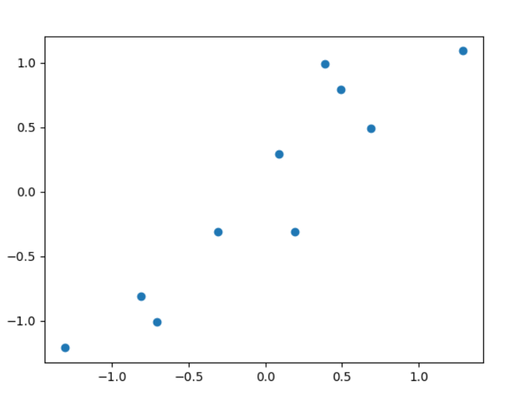
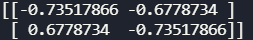
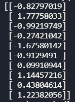
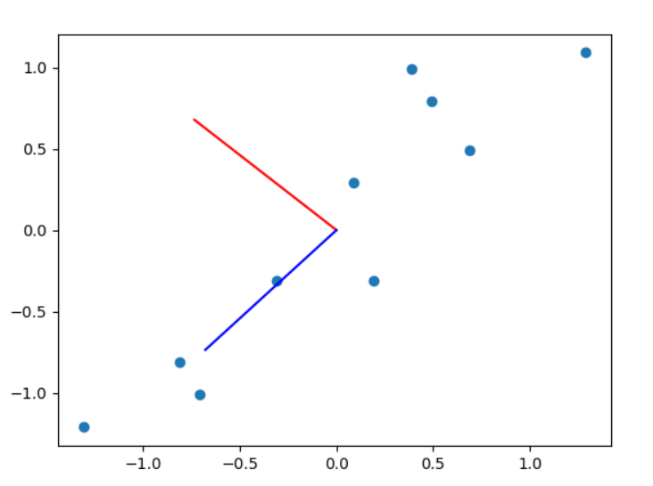

# PCA主成分分析实现报告

## $\S$ 1. PCA简述

PCA（Principal Component Analysis），全称**主成分分析**，主要应用于高维数据的降维，可以提取出数据的主要特征成分。
PCA可以**在数据损失最小的前提下**，将数据的特征数量由$n$，通过映射到另一个空间的形式，变为$k$(k $\le$ n)

## $\S$ 2. PCA求解步骤

### $\S$ 2.1 Sample Data

我们选取了一组二维数据来进行实验：
```python
x = np.array([2.5, 0.5, 2.2, 1.9, 3.1, 2.3, 2, 1, 1.5, 1.1])
y = np.array([2.4, 0.7, 2.9, 2.2, 3.0, 2.7, 1.6, 1.1, 1.6, 0.9])
```

### $\S$ 2.2 均值归零处理

```python
mean_x = np.mean(x)
mean_y = np.mean(y)
x_after = x - mean_x
y_after = y - mean_y
data = np.matrix([[x_after[i], y_after[i]] for i in range(len(x_after))])
```

我们可以用`matplotlib`画出这组数据的分布：
```python
plt.plot(x_after, y_after, 'o')
```



### $\S$ 2.3 对$X^TX$进行特征值分析

```python
point_matrix = np.dot(np.transpose(data), data)
eig_val, eig_vec = np.linalg.eig(point_matrix)
```

其中，`eig_val`得到的是特征值矩阵，`eig_vec`得到的是对应特征值下的特征向量。

可以得出特征向量有两个：


### $\S$ 2.4 选择主要成分并降维

本实验中我们令$k = 1$。
```python
eig_pair = [(np.abs(eig_val[i]), eig_vec[:,i]) for i in range(len(eig_val))]
eig_pair.sort(reverse=True)
maxx = eig_pair[0][1]
new_data = np.dot(data, maxx)
```
最后得到的新的数据为：



可以看出已经降到了一维上。
从图上看：



其实就是原始的数据点投影到蓝色向量上的结果。

代码完整版：
```python
import numpy as np
import matplotlib.pyplot as plt

#xy = np.array([2.5, 2.4], [0.5, 0.7], [2.2, 2.9], [1.9, 2.2], [3.1, 3.0], [2.3, 2.7], [2, 1.6], [1, 1.1], [1.5, 1.6], [1.1, 0.9])
x = np.array([2.5, 0.5, 2.2, 1.9, 3.1, 2.3, 2, 1, 1.5, 1.1])
y = np.array([2.4, 0.7, 2.9, 2.2, 3.0, 2.7, 1.6, 1.1, 1.6, 0.9])

#均值归零
mean_x = np.mean(x)
mean_y = np.mean(y)
x_after = x - mean_x
y_after = y - mean_y
data = np.matrix([[x_after[i], y_after[i]] for i in range(len(x_after))])
plt.plot(x_after, y_after, 'o')

#求协方差矩阵
point_matrix = np.dot(np.transpose(data), data)
eig_val, eig_vec = np.linalg.eig(point_matrix)
print(eig_vec)
plt.plot([eig_vec[:,0][0], 0], [eig_vec[:,0][1], 0], color = 'red')
plt.plot([eig_vec[:,1][0], 0], [eig_vec[:,1][1], 0], color = 'blue')

eig_pair = [(np.abs(eig_val[i]), eig_vec[:,i]) for i in range(len(eig_val))]
eig_pair.sort(reverse=True)
maxx = eig_pair[0][1]
# print(maxx)
new_data = np.dot(data, maxx)
print(new_data)
plt.show()
```